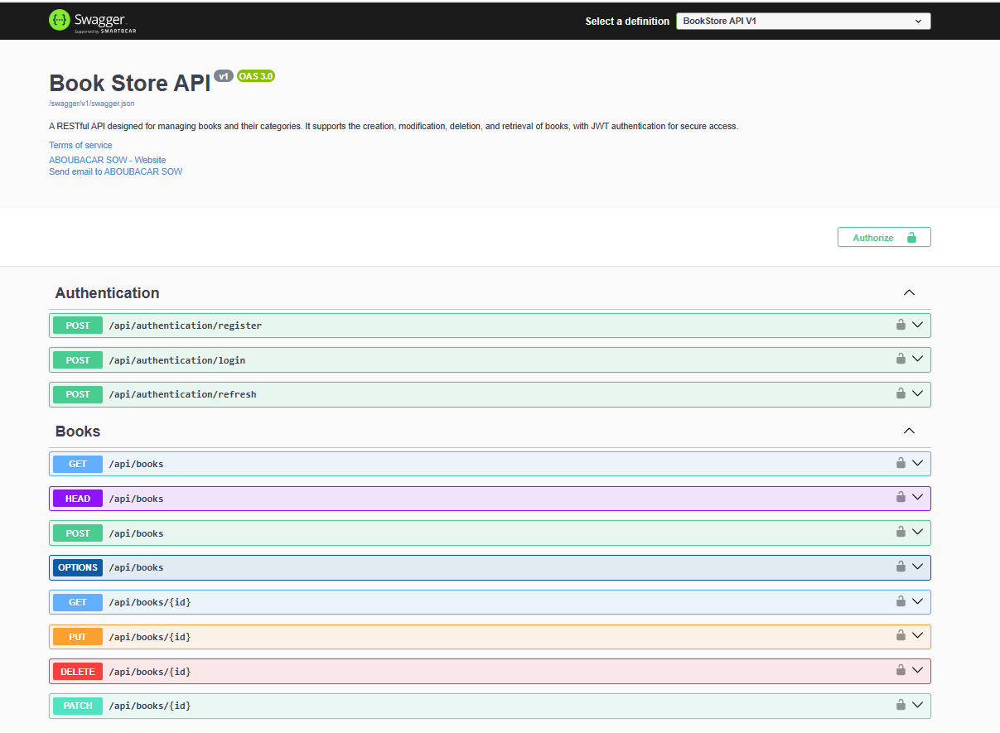
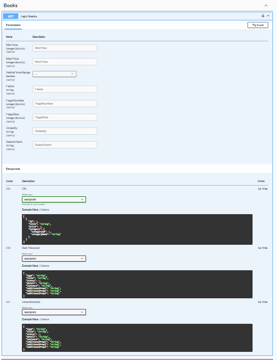
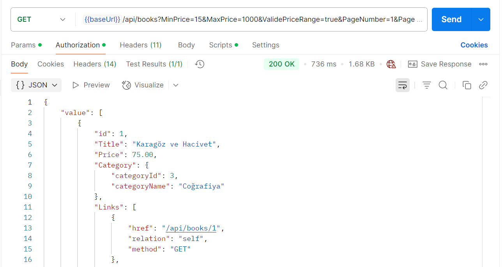
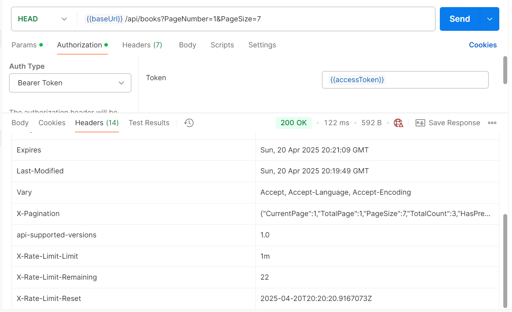
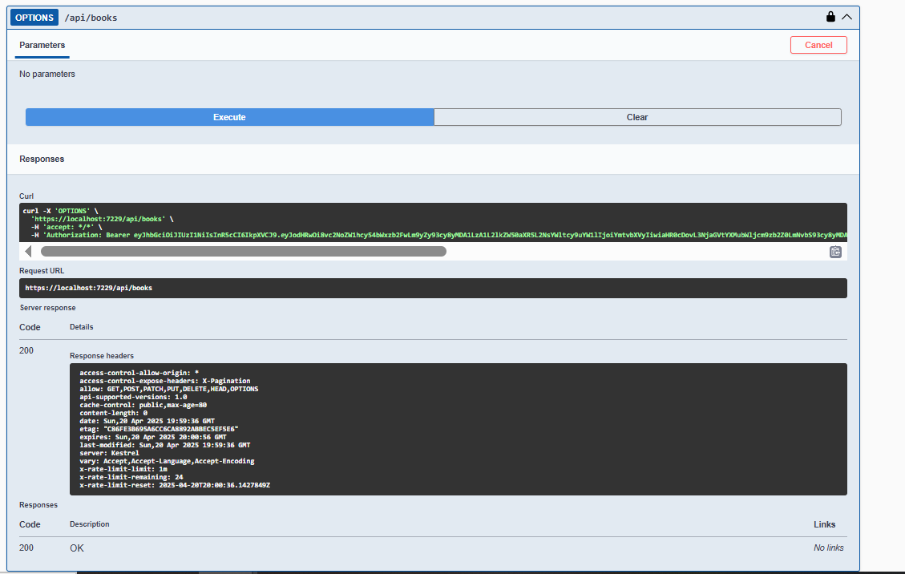
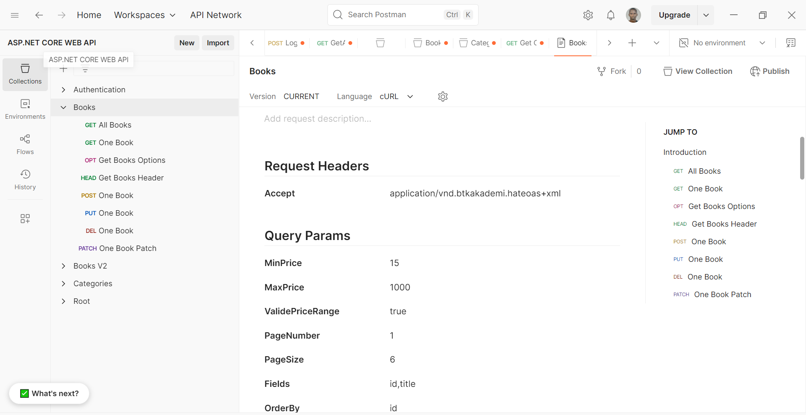
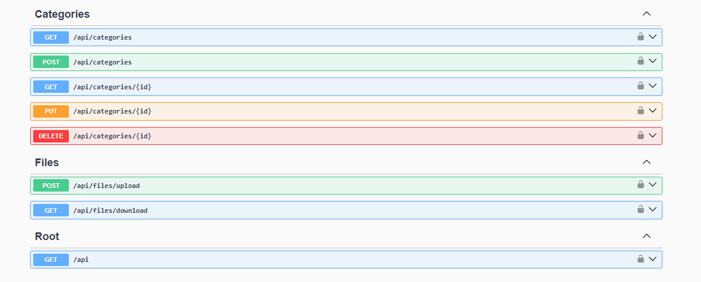
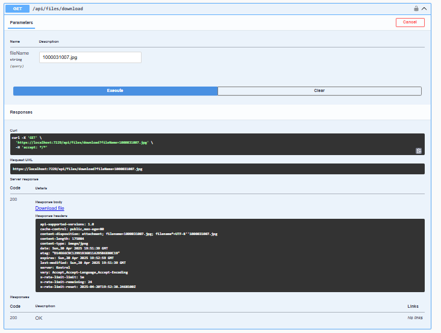
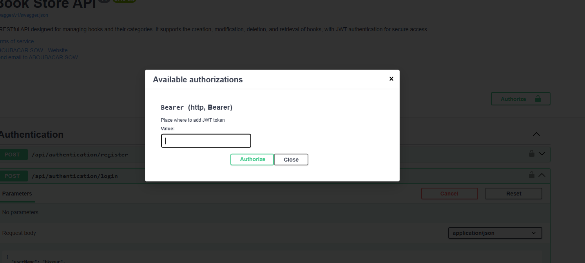

#                              BOOK STORE PROJECT

###                                    📚 BookStore API
#### A RESTful Web API built with ASP.NET Core for managing books and their categories. It supports full CRUD operations, pagination, filtering, sorting, and HATEOAS, with JWT-based authentication and role-based authorization.

### 🚀 Features

- ##### 📝 Comprehensive Logging
Implemented using NLog for detailed, configurable logging.

- ##### ❌ Global Error Handling
Centralized exception management through a custom middleware ExceptionMiddlewareExtension, with dedicated exception classes per entity.

- ##### 🔄 Automatic Object Mapping
Uses AutoMapper to simplify the mapping between models and DTOs.

- ##### 🔀 Content Negotiation
Supports multiple response formats: JSON, XML, and CSV.

- ##### ✅ Request Validation
Input validation handled via Action Filters to keep controllers clean.

- ##### ⚙️ Asynchronous Codebase
Fully asynchronous programming model for improved scalability and performance.

- ##### 📦 Pagination with Metadata
Includes metadata such as total items, page size, and current page in responses.

- ##### 🎯 Advanced Querying
  - ###### 🔍 Filtering: Narrow down results using query parameters

  - ###### 🧠 Searching: Perform keyword-based searches

  - ###### ↕️ Sorting: Sort results by one or more fields

  - ###### 🧩 Data Shaping: Select only specific fields (implemented on Book entity)

- ##### 🔗 HATEOAS (Hypermedia as the Engine of Application State)
Adds navigational links to enhance discoverability and self-documentation of the API.

- ##### 🧭 HTTP OPTIONS & HEAD Support
Provides clients with supported HTTP methods and resource availability.

- ##### 🏠 Root Documentation Endpoint
Root-level route offering API metadata and entry points.

- ##### 🧬 API Versioning
Enables multiple versions of the API to coexist seamlessly.

- ##### 🧠 Caching Mechanism
Response caching is implemented to optimize performance and reduce server load.

- ##### 🚦 Rate Limiting (Throttling)
Limits the number of requests per client to prevent abuse and ensure fair usage.

- ##### 🔐 Authentication & Authorization
- 👤 **Based on ASP.NET Identity**

- 🧾 **JWT-based tokens with Refresh Token support**

- 🛡️ **Role-based access control**

- ##### 📘 Interactive Swagger Documentation
Fully integrated with Swagger (OpenAPI) for live API testing and exploration.

- ##### 🧪 Postman Testing Collection
Includes a ready-to-use Postman collection for easy testing of all endpoints.

- ##### 📁 File Upload & Download
Supports uploading and downloading files via dedicated endpoints.

- ### 🛠️ Technologies Used
- 🧱 **ASP.NET Core Web API**
- 🗃️ **Entity Framework Core**
- 🛢️ **SQL Server**
- 🔄 **AutoMapper**
- 📘 **Swagger**
- 🧪 **Postman** (for testing)
- 🌐 **Proxies**
- 🚦 **ASP.NET CORE Rate Limit**
- 🧠 **Marvin.Cache.Headers**
- ✏️ **JsonPatch**
-🧾  **NewtonsoftJson**

#### Root Documentation:

#### BOOK Store Version 1 View

#### BOOK Store Version 2 View

#### GetAllBooks endpoint : request's Params and Possible Response

#### GetAllBooks endpoint: Request's Response with link for self-documentation

#### GetAllBooks endpoint: Request's Response Header
 

#### GetBooksOptions endpoint: Request's Response

#### Books Collection on Postman:

#### Category's Endpoints view:

#### GetAll Categories endpoint: Reques's params

#### Downloading Operation File: upload endpoint response

#### Authentication in Swagger:

